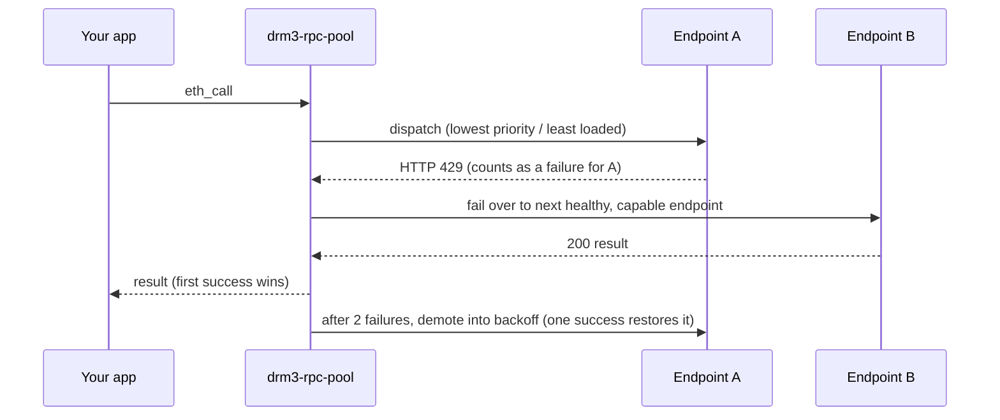
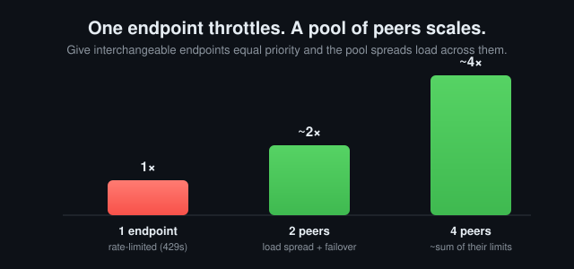

# drm3-rpc-pool

[](https://github.com/DRM3Labs-OSS/drm3-rpc-pool/actions/workflows/ci.yml)
[](https://github.com/DRM3Labs-OSS/drm3-rpc-pool/actions/workflows/wasm.yml)
[](./docs/benchmark.md)
[](./LICENSE)


> Pool many JSON-RPC endpoints behind one call: automatic failover, per-endpoint health, and load spreading across providers, on any EVM chain. Rust and TypeScript library - no sidecar needed.

## Why it exists

A single hardcoded RPC URL is one point of failure and one rate limit. Public providers 429 you, lag under load, and go down without warning; when yours does, your app does. `drm3-rpc-pool` puts a pool behind one `call`:

- **Failover** - when an endpoint 429s, errors, or times out, the next healthy one serves the request. Repeated failures demote an endpoint into exponential-backoff cooldown; one success restores it.
- **Load spreading** - list endpoints as **peers** (equal `priority`) and concurrent calls go to the least-loaded one. Your usable throughput becomes roughly the *sum* of their rate limits, not the cap of one. Pool ~10 free public endpoints and your effective free-tier rate climbs by about an order of magnitude. ([how this is measured](./docs/benchmark.md))
- **Any EVM chain** - every capability is a generic `eth_*` method. Built-in presets for Base, Ethereum, Arbitrum, Optimism, Polygon, and BNB.

Embed it as a **Rust** or **TypeScript** library. If your app is in neither, a language-agnostic [proxy](#proxy-for-any-other-language) is included.

## Rust

```toml
[dependencies]
drm3-rpc-pool = { git = "https://github.com/DRM3Labs-OSS/drm3-rpc-pool" }
```

```rust
use drm3_rpc_pool::{RpcEndpoint, RpcPool, RpcPoolConfig};
use serde_json::json;

#[tokio::main]
async fn main() -> Result<(), Box<dyn std::error::Error>> {
    // Equal priority => peers: each call goes to the least-loaded endpoint,
    // so load spreads across all three (and fails over if one dies).
    let endpoints = ["https://base.llamarpc.com", "https://base-rpc.publicnode.com", "https://mainnet.base.org"]
        .into_iter()
        .map(|url| RpcEndpoint { priority: 0, ..RpcEndpoint::new(url) })
        .collect();

    let pool = RpcPool::with_default_transport(RpcPoolConfig { endpoints, ..Default::default() });
    let block = pool.call("eth_blockNumber", json!([])).await?;
    println!("block = {block}");
    Ok(())
}
```

Build a config from a preset (`presets::config_for("base")`), a ranked URL list (`RpcPoolConfig::from_urls([..])`, distinct priorities = strict failover), or a TOML file (`RpcPoolConfig::from_toml_file(path)`). Bring your own HTTP client via the `Transport` trait and observability via `Metrics`. Default build bundles a `reqwest` transport; `default-features = false` drops it for a pure-library build.

## TypeScript (browser + Node)

The WASM binding runs the pool - failover, health, backoff, capability routing, load spreading - in WebAssembly; the network call is the platform `fetch`. Works in the browser, Web Workers, and Node 18+.

```sh
npm install @drm3labs-oss/rpc-pool
```

```ts
import { RpcPool } from "@drm3labs-oss/rpc-pool";
// Browser/bundler: `import init, { RpcPool } from "..."; await init();` first.

const pool = new RpcPool({
  endpoints: [
    // Same priority => peers: load spreads across them.
    { url: "https://base.llamarpc.com", priority: 0 },
    { url: "https://base-rpc.publicnode.com", priority: 0 },
    { url: "https://mainnet.base.org", priority: 0 },
  ],
});

const blockHex: string = await pool.call("eth_blockNumber", []);
console.log(parseInt(blockHex, 16));
console.log(pool.status()); // live per-endpoint health
```

Full config shape and browser/Node specifics: [`bindings/wasm/README.md`](./bindings/wasm/README.md).

## Configure routing

One choice decides how a burst is distributed. It is just `priority` (and an optional `max_in_flight` cap) per endpoint - same fields in Rust, TypeScript, and TOML.

| Goal | Set | Behavior |
|------|-----|----------|
| **Spread load** (extend free tier) | **same** `priority` on the peers | each call → least-loaded peer; throughput ≈ sum of their limits |
| **Failover** (prefer one) | **distinct** `priority` | tries lowest first, falls over only on error |
| **Primary + spill** (keyed provider) | keyed at low `priority` **+ `max_in_flight`**; peers above | rides the paid endpoint up to its cap, spills the overflow to free peers |

Primary-plus-spill, the common production shape - a paid key carries normal load, a burst overflows onto free peers instead of melting the primary:

```rust
let endpoints = vec![
    RpcEndpoint { priority: 0, max_in_flight: Some(50),         // keyed primary, soft cap
        ..RpcEndpoint::new("https://base-mainnet.g.alchemy.com/v2/${ALCHEMY_KEY}") },
    RpcEndpoint { priority: 1, ..RpcEndpoint::new("https://base.llamarpc.com") },   // free
    RpcEndpoint { priority: 1, ..RpcEndpoint::new("https://mainnet.base.org") },    // free peer
];
```

## How it works



- **Candidate order** is `(saturated, priority, in-flight, index)`. Lower `priority` is always preferred; within a priority tier the least-loaded endpoint wins (peers spread); an endpoint at its `max_in_flight` cap is *saturated* and sorts behind anything with headroom (it spills), but stays a last resort so requests are never dropped.
- **First-success-wins** dispatch with a per-call retry budget (`max_retries`, `0` = try every candidate).
- **Failure detection** - any non-2xx (429, 5xx), transport error, or unparseable body is a failure for that endpoint. A well-formed JSON-RPC error result is a valid answer, returned as-is.
- **Health + backoff** - `demotion_threshold` (default 2) consecutive failures demote an endpoint into exponential cooldown (base 2s, doubled per failure, capped 300s). One success resets it.
- **Capability routing** - tag an endpoint with the methods it serves; calls it can't serve skip it. Empty = serves everything.
- **Per-endpoint controls** - client-side `max_rps` throttle (a throttled endpoint is skipped, not awaited) and `auth` (URL-baked key, header, or bearer; secrets via `${ENV_VAR}`).

## Throughput under load

When a burst exceeds one endpoint's capacity, strict failover keeps hammering the first endpoint and leaves the rest of the pool idle. Peers spread the load, so sustained throughput scales with the pool.



That mechanism is measured in a controlled, deterministic benchmark - and the honest caveats (why a model, and how noisy real free-RPC numbers are) are spelled out in **[docs/benchmark.md](./docs/benchmark.md)**.

## Config reference

Library callers set these as Rust fields / TS object keys; the proxy reads them from TOML. Every string supports `${ENV_VAR}` templating, and a referenced-but-unset variable is a hard error (a missing key never silently degrades to an unauthenticated request).

Pool-level: `request_timeout_ms` (per-attempt timeout, default 15s), `max_retries` (endpoints to try per call, `0` = all). Per endpoint:

| Field | Type | Default | Notes |
|-------|------|---------|-------|
| `url` | string | required | HTTP(S) JSON-RPC URL. |
| `label` | string | - | Tag for logs / `/metrics`; falls back to the URL. |
| `priority` | integer | `0` | Lower tried first; **equal = peers** (load spreads); ties break by order. |
| `max_in_flight` | integer | unset | Soft concurrency cap; at the cap the endpoint spills to peers. |
| `max_rps` | integer | unset | Client-side rate throttle; a throttled endpoint is skipped, not awaited. |
| `capabilities` | string[] | `[]` | Methods this endpoint may serve, e.g. `["eth_call"]`. Empty = all. |
| `auth` | table | `{ type = "none" }` | `url_key`, `{ type="header", name, value }`, or `{ type="bearer", token }`. |

```toml
# rpc-pool.toml - secrets stay in the environment via ${ENV_VAR}.
request_timeout_ms = 8000

[[endpoints]]                                  # keyed primary
url = "https://base-mainnet.g.alchemy.com/v2/${ALCHEMY_KEY}"
priority = 0
max_in_flight = 50
auth = { type = "url_key" }

[[endpoints]]                                  # free peers (equal priority => spread)
url = "https://base.llamarpc.com"
priority = 1

[[endpoints]]
url = "https://mainnet.base.org"
priority = 1
```

Presets (`base`, `ethereum`/`eth`, `arbitrum`/`arb`, `optimism`/`op`, `polygon`/`matic`, `bnb`/`bsc`) ship public, no-key endpoint lists as a starting point - override them with your own keyed providers. A full annotated config is in [`examples/rpc-pool.toml`](./examples/rpc-pool.toml).

## Proxy (for any other language)

If your app isn't Rust or TypeScript, run the bundled proxy and point any JSON-RPC client at it - no code change. This is the fallback, not the main path.

```sh
cargo install --path .                      # or download a release binary
drm3-rpc-pool init base > rpc-pool.toml     # scaffold from a preset, then edit
export ALCHEMY_KEY=...                       # whatever the config references
drm3-rpc-pool --config rpc-pool.toml         # serves on 127.0.0.1:8545
```

Point your tooling at it (`ethers`/`viem`/`web3.py`/`cast`/`hardhat`): set the RPC URL to `http://127.0.0.1:8545`. Single requests and batch arrays both work. Routes:

- `POST /` - JSON-RPC entrypoint. Preserves the client `id`; relays upstream error envelopes and pool errors (`-32010` all upstreams failed, `-32011` no healthy endpoints).
- `GET /health` - `200` with `{ status, endpoints_total, endpoints_healthy }`, `503` if empty.
- `GET /metrics` - per-endpoint status + live health, JSON.

Docker:

```sh
docker run --rm -p 8545:8545 -e ALCHEMY_KEY=... \
  -v "$PWD/rpc-pool.toml:/etc/drm3/rpc-pool.toml:ro" drm3-rpc-pool
```

> **Binding `0.0.0.0` exposes an unauthenticated relay.** The proxy has no auth of its own, so anything that reaches the listen address can spend your keyed providers. Only bind `0.0.0.0` behind a firewall or your own auth. The default `127.0.0.1` is safe.

## Install

- **Rust library:** git dependency above (works today); `cargo add drm3-rpc-pool` after the first crates.io release.
- **TypeScript:** `npm i @drm3labs-oss/rpc-pool` after the first npm release; until then build from [`bindings/wasm`](./bindings/wasm) with `wasm-pack`.
- **Proxy from source:** `git clone … && cargo build --release` → `./target/release/drm3-rpc-pool`.
- **Prebuilt binaries:** linux/macOS/Windows attached to each [GitHub Release](https://github.com/DRM3Labs-OSS/drm3-rpc-pool/releases) (after the first `v*` tag), with `SHA256SUMS`.

Cargo features: `reqwest-transport` (default; bundled HTTP client - disable to supply your own `Transport`), `daemon` (default; the proxy binary + HTTP server - disable for a pure library build).

## License

MIT © DRM3 Labs Corp.
