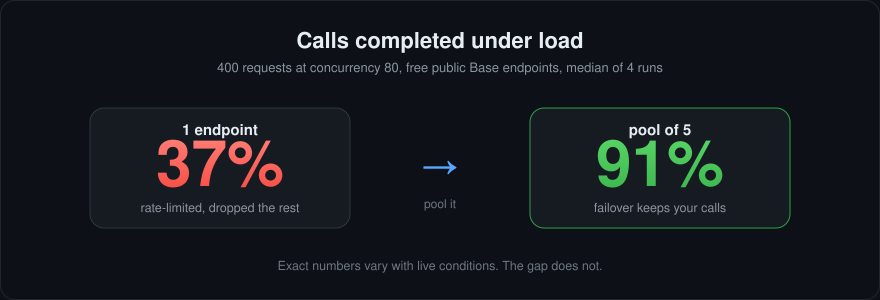
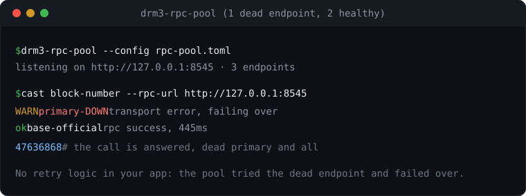
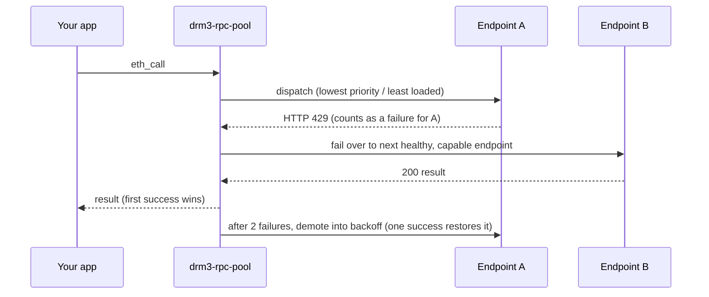

# drm3-rpc-pool

[](https://github.com/DRM3Labs-OSS/drm3-rpc-pool/actions/workflows/ci.yml)
[](https://github.com/DRM3Labs-OSS/drm3-rpc-pool/actions/workflows/wasm.yml)
[](./LICENSE)


> Put a pool of JSON-RPC endpoints behind one call so a single provider's 429s, lag, or outage doesn't become yours. Automatic failover and load-aware routing, on any EVM chain. Rust and TypeScript library, no sidecar needed.



## Why it exists

A single hardcoded RPC URL is one point of failure. Public providers 429 you, lag under load, and go down without warning; when yours does, your app does. `drm3-rpc-pool` puts a pool behind one `call` and retries the next healthy endpoint on any 429, error, or timeout. Repeated failures demote an endpoint into exponential-backoff cooldown; one success restores it.

**What you get over a single URL** ([details](./docs/measurements.md)):

- **Reliability - yes.** Under a burst, a single free public endpoint completed 30-50% of calls; a pool of two or more completed ~all of them.
- **More throughput from free tiers - no.** Free public RPCs rate-limit per IP and some are flaky, so pooling them does *not* multiply throughput. Throughput aggregates only across endpoints with independent capacity - your own keyed providers on separate accounts - where pooling them as peers gives roughly the sum of their limits.
- **Lower cost on heavy workloads - yes.** Cap your paid provider with `max_in_flight` and put free endpoints behind it: bursts spill onto the free tier instead of your metered bill (or invert it to stay free-first).

Works on any EVM chain (every capability is a generic `eth_*` method; presets for Base, Ethereum, Arbitrum, Optimism, Polygon, BNB). Embed it as a **Rust** or **TypeScript** library; if your app is in neither, a language-agnostic [proxy](#proxy-for-any-other-language) is included.

## Rust

```toml
[dependencies]
drm3-rpc-pool = { git = "https://github.com/DRM3Labs-OSS/drm3-rpc-pool" }
```

```rust,ignore
use drm3_rpc_pool::{presets, RpcPool};
use serde_json::json;

#[tokio::main]
async fn main() -> Result<(), Box<dyn std::error::Error>> {
    // Recommended default: the chain's public endpoints as equal-priority peers,
    // so load spreads across them and fails over. No keys, no config file.
    let pool = RpcPool::with_default_transport(presets::peers_for("base").unwrap());

    let block = pool.call("eth_blockNumber", json!([])).await?;
    println!("block = {block}");
    Ok(())
}
```

Other ways to build a config: `presets::config_for("base")` (the same endpoints as a ranked failover chain), `RpcPoolConfig::from_urls([..])` (a ranked URL list), or `RpcPoolConfig::from_toml_file(path)`. Bring your own HTTP client via the `Transport` trait and observability via `Metrics`. The default build bundles a `reqwest` transport; `default-features = false` drops it for a pure-library build.

## TypeScript (browser + Node)

The WASM binding runs the pool - failover, health, backoff, capability routing, load spreading - in WebAssembly; the network call is the platform `fetch`. Works in the browser, Web Workers, and Node 18+.

```sh
npm install @drm3labs-oss/rpc-pool
```

```ts
import { RpcPool } from "@drm3labs-oss/rpc-pool";
// Browser/bundler: `import init, { RpcPool } from "..."; await init();` first.

const pool = new RpcPool({
  endpoints: [
    // Same priority => peers: load spreads across them.
    { url: "https://base.llamarpc.com", priority: 0 },
    { url: "https://base-rpc.publicnode.com", priority: 0 },
    { url: "https://mainnet.base.org", priority: 0 },
  ],
});

const blockHex: string = await pool.call("eth_blockNumber", []);
console.log(parseInt(blockHex, 16));
console.log(pool.status()); // live per-endpoint health
```

Full config shape and browser/Node specifics: [`bindings/wasm/README.md`](./bindings/wasm/README.md).

## Configure routing

**Recommended default:** pool the free public endpoints as **peers** - `presets::peers_for("base")` in Rust, or set every endpoint to `priority: 0` in TS/TOML. Load spreads across them and any one can fail over. Add a keyed provider only when you need more than the free tier (the "primary + spill" row below).

One choice decides how a burst is distributed. It is just `priority` (and an optional `max_in_flight` cap) per endpoint - same fields in Rust, TypeScript, and TOML.

| Goal | Set | Behavior |
|------|-----|----------|
| **Spread load** (extend free tier) | **same** `priority` on the peers | each call → least-loaded peer; throughput ≈ sum of their limits |
| **Failover** (prefer one) | **distinct** `priority` | tries lowest first, falls over only on error |
| **Primary + spill** (keyed provider) | keyed at low `priority` **+ `max_in_flight`**; peers above | rides the paid endpoint up to its cap, spills the overflow to free peers |

Primary-plus-spill, the common production shape - a paid key carries normal load, a burst overflows onto free peers instead of melting the primary:

```rust,ignore
let endpoints = vec![
    RpcEndpoint { priority: 0, max_in_flight: Some(50),         // keyed primary, soft cap
        ..RpcEndpoint::new("https://base-mainnet.g.alchemy.com/v2/${ALCHEMY_KEY}") },
    RpcEndpoint { priority: 1, ..RpcEndpoint::new("https://base.llamarpc.com") },   // free
    RpcEndpoint { priority: 1, ..RpcEndpoint::new("https://mainnet.base.org") },    // free peer
];
```

## How it works

A dead endpoint, two healthy ones, one call: the pool tries the dead one, fails over, and returns the result. No retry logic in your app.





- **Candidate order** is `(saturated, priority, in-flight, index)`. Lower `priority` is always preferred; within a priority tier the least-loaded endpoint wins (peers spread); an endpoint at its `max_in_flight` cap is *saturated* and sorts behind anything with headroom (it spills), but stays a last resort so requests are never dropped.
- **First-success-wins** dispatch with a per-call retry budget (`max_retries`, `0` = try every candidate).
- **Failure detection** - any non-2xx (429, 5xx), transport error, or unparseable body is a failure for that endpoint. A well-formed JSON-RPC error result is a valid answer, returned as-is.
- **Health + backoff** - `demotion_threshold` (default 2) consecutive failures demote an endpoint into exponential cooldown (base 2s, doubled per failure, capped 300s). One success resets it.
- **Capability routing** - tag an endpoint with the methods it serves; calls it can't serve skip it. Empty = serves everything.
- **Per-endpoint controls** - client-side `max_rps` throttle (a throttled endpoint is skipped, not awaited) and `auth` (URL-baked key, header, or bearer; secrets via `${ENV_VAR}`).

## Gotchas

- **The proxy has no auth.** Anything that can reach its listen address can spend your keyed providers. The default `127.0.0.1` bind is safe; only use `0.0.0.0` behind a firewall or your own auth.
- **Free public endpoints are failover, not a throughput farm.** They rate-limit per IP and some are flaky. Pooling them buys reliability, not raw req/s; don't expect throughput to scale with pool size on free endpoints ([why](./docs/measurements.md)).
- **Spreading sends traffic to every peer, including a bad one,** until health-backoff demotes it (2 failures). If a set of endpoints is known to be uneven in quality, ranked failover (distinct `priority`) can be steadier than peers.
- **`request_timeout_ms` is advisory in the WASM build** - it relies on the platform `fetch` default rather than an abort deadline.
- **The pool can't authenticate *you* to a provider.** Keyed access still needs the key, set per endpoint via `auth` and `${ENV_VAR}`.

## Best practices

- **Free tier, no key:** `presets::peers_for("base")` (Rust) or `priority: 0` on every endpoint - failover plus load spreading across interchangeable peers.
- **You have a paid key:** put it first (`priority: 0`) with a `max_in_flight` cap and free endpoints behind it. Normal traffic runs on the key; bursts spill to free instead of your bill.
- **You want max throughput:** pool endpoints with *independent* capacity (keyed providers on separate accounts) as peers - that is the only setup where throughput aggregates.
- **Always add your own providers.** Presets are a starting point of public endpoints that come and go; a keyed provider is your floor.
- **Measure your own pool** before trusting numbers: `cargo run --release --example throughput -- --mode sweep --route spread --runs 3 --warmup`.

## Config reference

Library callers set these as Rust fields / TS object keys; the proxy reads them from TOML. Every string supports `${ENV_VAR}` templating, and a referenced-but-unset variable is a hard error (a missing key never silently degrades to an unauthenticated request).

Pool-level: `request_timeout_ms` (per-attempt timeout, default 15s), `max_retries` (endpoints to try per call, `0` = all). Per endpoint:

| Field | Type | Default | Notes |
|-------|------|---------|-------|
| `url` | string | required | HTTP(S) JSON-RPC URL. |
| `label` | string | - | Tag for logs / `/metrics`; falls back to the URL. |
| `priority` | integer | `0` | Lower tried first; **equal = peers** (load spreads); ties break by order. |
| `max_in_flight` | integer | unset | Soft concurrency cap; at the cap the endpoint spills to peers. |
| `max_rps` | integer | unset | Client-side rate throttle; a throttled endpoint is skipped, not awaited. |
| `capabilities` | string[] | `[]` | Methods this endpoint may serve, e.g. `["eth_call"]`. Empty = all. |
| `auth` | table | `{ type = "none" }` | `url_key`, `{ type="header", name, value }`, or `{ type="bearer", token }`. |

```toml
# rpc-pool.toml - secrets stay in the environment via ${ENV_VAR}.
request_timeout_ms = 8000

[[endpoints]]                                  # keyed primary
url = "https://base-mainnet.g.alchemy.com/v2/${ALCHEMY_KEY}"
priority = 0
max_in_flight = 50
auth = { type = "url_key" }

[[endpoints]]                                  # free peers (equal priority => spread)
url = "https://base.llamarpc.com"
priority = 1

[[endpoints]]
url = "https://mainnet.base.org"
priority = 1
```

Presets (`base`, `ethereum`/`eth`, `arbitrum`/`arb`, `optimism`/`op`, `polygon`/`matic`, `bnb`/`bsc`) ship public, no-key endpoint lists as a starting point - override them with your own keyed providers. A full annotated config is in [`examples/rpc-pool.toml`](./examples/rpc-pool.toml).

## Proxy (for any other language)

If your app isn't Rust or TypeScript, run the bundled proxy and point any JSON-RPC client at it - no code change. This is the fallback, not the main path.

```sh
cargo install --path .                      # or download a release binary
drm3-rpc-pool init base > rpc-pool.toml     # recommended free public Base list; runs as-is, no key
drm3-rpc-pool --config rpc-pool.toml         # serves on 127.0.0.1:8545
```

`init` writes a ready-to-run list of the chain's free public endpoints as peers (no key needed); to add your own keyed providers, drop them in at `priority = 0` with `${ENV_VAR}` secrets - the scaffold's comments show the exact shape. Point your tooling at it (`ethers`/`viem`/`web3.py`/`cast`/`hardhat`): set the RPC URL to `http://127.0.0.1:8545`. Single requests and batch arrays both work. Routes:

- `POST /` - JSON-RPC entrypoint. Preserves the client `id`; relays upstream error envelopes and pool errors (`-32010` all upstreams failed, `-32011` no healthy endpoints).
- `GET /health` - `200` with `{ status, endpoints_total, endpoints_healthy }`, `503` if empty.
- `GET /metrics` - per-endpoint status + live health, JSON.

**Structured logs.** Run with `--log-format json` and the proxy emits one JSON event per line on stdout (route decision, endpoint, url, method, latency, request/response bytes, and error/status on failover), so you can pipe it to any log sink. `RUST_LOG=drm3_rpc_pool=debug` includes the per-attempt success/failover events.

> **Binding `0.0.0.0` exposes an unauthenticated relay.** The proxy has no auth of its own, so anything that reaches the listen address can spend your keyed providers. The default `listen = "127.0.0.1:8545"` is localhost-only and safe; only set `0.0.0.0` behind a firewall or your own auth.

## Install

- **Rust library:** git dependency above (works today); `cargo add drm3-rpc-pool` after the first crates.io release.
- **TypeScript:** `npm i @drm3labs-oss/rpc-pool` after the first npm release; until then build from [`bindings/wasm`](./bindings/wasm) with `wasm-pack`.
- **Proxy from source:** `git clone … && cargo build --release` → `./target/release/drm3-rpc-pool`.
- **Prebuilt binaries:** linux/macOS/Windows attached to each [GitHub Release](https://github.com/DRM3Labs-OSS/drm3-rpc-pool/releases) (after the first `v*` tag), with `SHA256SUMS`.

Cargo features: `reqwest-transport` (default; bundled HTTP client - disable to supply your own `Transport`), `daemon` (default; the proxy binary + HTTP server - disable for a pure library build).

## License

MIT © DRM3 Labs Corp.
