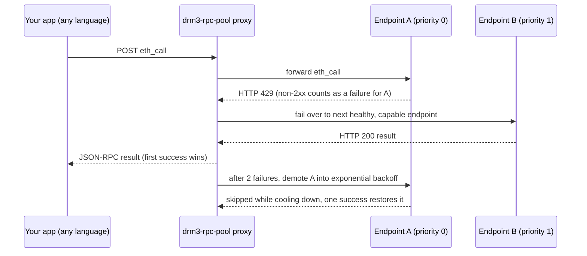

# drm3-rpc-pool

[](https://github.com/DRM3Labs-OSS/drm3-rpc-pool/actions/workflows/ci.yml)
[](./LICENSE)

> Config-driven JSON-RPC failover proxy for any EVM chain. Point any app at one endpoint and get automatic failover, health-aware routing, and rate-limit handling across your RPC providers. Rust library + WASM/TS package.

## The problem

A single hardcoded RPC URL is a single point of failure. Public providers rate-limit you (HTTP 429), lag under load, and go down without warning, and when yours does, your app goes down with it. Hardcoding one endpoint means betting your uptime on someone else's worst day.

drm3-rpc-pool fixes this without touching your app code: give it an ordered list of endpoints and point your app at the proxy. It does first-success-wins dispatch with per-endpoint health tracking, exponential backoff, capability routing, and automatic failover. Every capability is a generic `eth_*` method, so it works the same on Ethereum, Base, Arbitrum, Optimism, Polygon, BNB, or any other EVM chain. You do **not** need to write Rust to use it. Run the proxy, point any app in any language at its local address, and it inherits failover for free.

## Results: with vs without

The chart and table below come from a **controlled, deterministic benchmark**, rendered by the benchmark tool and refreshed by [`benchmark.yml`](./.github/workflows/benchmark.yml) (run it from the Actions tab, or it runs weekly). It answers one question: when a burst is bigger than any single endpoint can absorb, does the pool actually use the *rest* of its endpoints? To measure that without public-RPC noise drowning the signal, it runs entirely in-process against synthetic endpoints with a fixed latency and a fixed concurrency limit (excess requests queue — a saturated-but-healthy endpoint, not an error). The only variable across the bars is the **routing strategy**.

The result: **strict failover leaves most of the pool idle.** Because `chain` routing only fails over on an *error*, a saturated-but-healthy primary just queues the whole burst while the other endpoints sit unused — throughput pins at the single-endpoint ceiling. Load-aware routing fixes this: `spread` (least in-flight across equal-priority peers) and `capped` (ride a preferred primary up to a `max_in_flight` cap, then spill to failover) put work on every endpoint and clear the burst at roughly the full-pool rate. This is a lab benchmark by design; real-network numbers against free public RPCs are far noisier and dominated by which endpoint happens to be healthy in the moment, which is exactly why the mechanism is shown here in isolation.

<!-- BENCHMARK:START -->
**Controlled benchmark — 3 endpoints, each capacity 40 @ 50ms, 600 requests @ concurrency 200, median of 3 runs**

_Method: a deterministic, in-process A/B (no network) that isolates the routing strategy. Each synthetic endpoint serves 40 requests at once at a fixed 50ms; excess requests queue (a saturated-but-healthy endpoint, not an error). One endpoint tops out at **800 req/s**; the whole 3-endpoint pool can do **2400 req/s**. The only variable is how the pool routes. This is a lab benchmark by design — it removes public-RPC noise so the mechanism is legible; field numbers against free public endpoints are far noisier and dominated by which endpoint is healthy in the moment._


| Routing | Throughput (req/s) | p50 | p95 | Success | What happens |
|---------|-------------------:|----:|----:|--------:|--------------|
| chain (strict failover) | 770.7 (770.4–774.7) | 259 ms | 260 ms | 100% | rides one endpoint; the rest of the pool is idle |
| spread (least in-flight) | 1919.1 (1913–1924.6) | 103 ms | 104 ms | 100% | fills every peer evenly |
| capped (cap=40) | 1650.1 (1648.2–1650.3) | 52 ms | 156 ms | 100% | rides the primary to its cap, then spills |

#### What this proves

- **Strict failover leaves capacity on the table.** `chain` sends every request to endpoint #1 first and only fails over on an *error*. A saturated-but-healthy endpoint never errors, so the burst queues on one endpoint while the other 2 sit idle — throughput pins at the single-endpoint ceiling (~800 req/s).
- **Load-aware routing uses the whole pool.** `spread` (least in-flight across equal-priority peers) and `capped` (ride a preferred primary up to `max_in_flight`, then spill) both put work on every endpoint, ~2.5× the throughput of `chain` — and `capped` also gives the best p50 because the primary's first cap-worth of requests never queue.
- **Pick by goal.** Homogeneous peers and want max throughput → `spread` (equal `priority`). Want a keyed/paid primary to carry load but not melt down under a burst → `capped` (lower `priority` + `max_in_flight`). Want strict ordering and accept the bottleneck → leave it `chain` (distinct priorities, no cap), the default.
- **Implementation:** dispatch orders candidates by `(saturated, priority, in-flight, index)` in `src/pool/mod.rs`; every endpoint tracks live in-flight load, and a soft `max_in_flight` cap marks an endpoint saturated so traffic spills to peers before piling on.

_Auto-generated 2026-06-19 02:52:58 UTC. Deterministic controlled benchmark; reproduce: `cargo run --release --example throughput -- --mock --mock-endpoints 3 --mock-capacity 40 --mock-latency-ms 50 --route spread --runs 3 --requests 600 --concurrency 200` (see [Throughput benchmark](#throughput-benchmark))._
<!-- BENCHMARK:END -->

## How it works



- **Unbounded, priority-ordered pool.** Lower `priority` is tried first; ties break by config order.
- **First-success-wins dispatch.** Try candidates in order, return the moment one succeeds.
- **Load-aware routing.** Candidates are ordered by `(saturated, priority, in-flight, index)`. A strictly lower `priority` is always preferred, but endpoints sharing a priority are **peers**: the pool sends each call to the least-loaded one, so concurrent traffic spreads across a tier instead of stacking on the first. Set a peer's priority equal to share load; keep priorities distinct for strict failover.
- **Soft concurrency cap (`max_in_flight`).** Optional per-endpoint ceiling. Once an endpoint hits it, it is marked *saturated* and new calls spill to a less-loaded peer (or the next tier) instead of piling on, falling back to it only if nothing else is free. This makes a ranked pool adaptive: a primary carries load up to its cap, then the burst spills to failover. See the [benchmark](#results-with-vs-without).
- **Failure detection.** Any non-2xx response (429 rate-limit, 5xx, etc.) or transport error counts as a failure for that endpoint.
- **Demotion + backoff.** After `demotion_threshold` (default 2) consecutive failures an endpoint is demoted into an exponentially growing cooldown (base 2s, doubling per failure, capped at 300s). One success resets it.
- **Capability routing.** Tag an endpoint with the methods it supports and the pool skips it for calls it cannot serve. An empty list means "supports everything".
- **Per-endpoint rate limiting.** Optional client-side `max_rps`; a locally-throttled endpoint is skipped (failed over), never awaited.
- **Per-endpoint auth.** URL-baked keys, custom headers, or bearer tokens, with secrets pulled from the environment.

## Install

Nothing is published to a package registry yet, so the two paths that work **today** are building from source and the git dependency. The registry and release options below are wired up and will work once the first version is tagged and published.

### From source (works today)

Clone and build the proxy with Cargo (needs a stable Rust toolchain):

```sh
git clone https://github.com/DRM3Labs-OSS/drm3-rpc-pool
cd drm3-rpc-pool
cargo build --release
# binary lands at ./target/release/drm3-rpc-pool
./target/release/drm3-rpc-pool init base > rpc-pool.toml
./target/release/drm3-rpc-pool --config rpc-pool.toml
```

Or install the proxy onto your `PATH`:

```sh
cargo install --path .
drm3-rpc-pool init base > rpc-pool.toml   # write a starter config
drm3-rpc-pool --config rpc-pool.toml      # run the proxy (defaults to ./rpc-pool.toml)
```

The binary has one subcommand, `init <chain>` (writes a starter config to stdout), and otherwise runs the proxy; see [Primary usage](#primary-usage-the-proxy-no-rust-required).

### As a Rust library

After the first crates.io release:

```sh
cargo add drm3-rpc-pool
```

The git dependency works **today**, before any crates.io release - add to your `Cargo.toml`:

```toml
[dependencies]
drm3-rpc-pool = { git = "https://github.com/DRM3Labs-OSS/drm3-rpc-pool" }
```

For a pure library build with no proxy daemon, disable default features and bring your own transport: `{ git = "...", default-features = false }`. See [Secondary usage: the Rust library](#secondary-usage-the-rust-library).

### As a JS/TS package (browser + Node)

After the first npm release, the WASM binding ([`bindings/wasm`](./bindings/wasm)) publishes as a scoped package:

```sh
npm i @drm3labs-oss/rpc-pool
```

It runs failover, per-endpoint health, backoff, and capability routing in the browser or Node; the network calls are done by the platform `fetch`. Until that release lands, build it locally from `bindings/wasm` with `wasm-pack` (`npm run build:web` / `build:node`).

### Prebuilt binary

After the first tagged release (`v*`), prebuilt proxy binaries for linux (x64 + arm64), macOS (x64 + arm64), and Windows (x64) are attached to each [GitHub Release](https://github.com/DRM3Labs-OSS/drm3-rpc-pool/releases) alongside `SHA256SUMS`. Download, verify, and run:

```sh
# (available once a vX.Y.Z tag has been pushed)
tar xzf drm3-rpc-pool-vX.Y.Z-x86_64-unknown-linux-gnu.tar.gz
./drm3-rpc-pool --config rpc-pool.toml
```

## Primary usage: the proxy (no Rust required)

### 1. Scaffold a config

```sh
drm3-rpc-pool init base > rpc-pool.toml
```

`init` writes a starter config from a chain preset. Available presets: `base`, `ethereum`, `arbitrum`, `optimism`, `polygon`, `bnb` (aliases: `eth`/`mainnet`, `arb`, `op`, `matic`, `bsc`).

### 2. Edit endpoints and keys

Open `rpc-pool.toml`, add your own keyed providers at a lower `priority` so paid capacity is preferred and the public URLs act as failover. Put secrets in the environment via `${ENV_VAR}` templating (see [Auth](#auth--keyed-providers)). A full annotated example lives in [`examples/rpc-pool.toml`](./examples/rpc-pool.toml).

### 3. Run the proxy

```sh
export ALCHEMY_KEY=...          # whatever your config references
drm3-rpc-pool --config rpc-pool.toml
# drm3-rpc-pool listening on http://127.0.0.1:8545 (N endpoints)
```

`--config` defaults to `./rpc-pool.toml`, so plain `drm3-rpc-pool` works once the file exists.

### 4. Point any app at it

Set your application's RPC URL to the proxy's `listen` address. Examples:

```sh
# ethers.js / viem / web3.py / cast / hardhat - just change the URL:
export RPC_URL=http://127.0.0.1:8545
cast block-number --rpc-url http://127.0.0.1:8545
```

Everything that speaks JSON-RPC over HTTP works unchanged - single requests and batch arrays are both supported.

### Run with Docker (optional)

```sh
docker build -t drm3-rpc-pool .

docker run --rm -p 8545:8545 \
  -e ALCHEMY_KEY=... \
  -v "$PWD/rpc-pool.toml:/etc/drm3/rpc-pool.toml:ro" \
  drm3-rpc-pool
```

The image's default command is `--config /etc/drm3/rpc-pool.toml`. To reach the proxy from outside the container, set `listen = "0.0.0.0:8545"` in your config.

> **Warning: binding `0.0.0.0` exposes an unauthenticated relay.** The proxy has no auth of its own, so anything that can reach the listen address can spend your keyed/paid upstream providers. Only bind `0.0.0.0` behind a firewall, a private network, or your own auth layer. The default `127.0.0.1` is safe.

## Config schema

Configuration is TOML. Every string field supports `${ENV_VAR}` templating; a referenced-but-unset variable is a hard error, so a missing key never silently degrades to an unauthenticated request.

| Field | Type | Default | Notes |
|-------|------|---------|-------|
| `listen` | string | `127.0.0.1:8545` | `host:port` the proxy binds to. Use `0.0.0.0:8545` only behind a firewall/auth (see the Docker warning). Ignored by library callers. |
| `request_timeout_ms` | integer | transport default (15s) | Per-request timeout applied to each upstream attempt. |
| `max_retries` | integer | `0` | Max endpoints to try per call. `0` = try every healthy, capable candidate. |
| `[[endpoints]]` | array | - | One or more endpoint tables (below). At least one is required. |

Each `[[endpoints]]` table:

| Field | Type | Default | Notes |
|-------|------|---------|-------|
| `url` | string | required | HTTP(S) JSON-RPC URL. |
| `label` | string | - | Human-readable tag for logs and `/metrics`. Falls back to the URL. |
| `priority` | integer | `0` | Sort key. Lower is tried first; ties break by config order. |
| `capabilities` | array of strings | `[]` | Methods this endpoint may serve, e.g. `["eth_call", "eth_getLogs"]`. Empty = supports everything. |
| `max_rps` | integer | unthrottled | Client-side requests-per-second throttle. |
| `auth` | table | `{ type = "none" }` | See [Auth](#auth--keyed-providers). |

```toml
listen = "127.0.0.1:8545"
request_timeout_ms = 8000
max_retries = 0

[[endpoints]]
url = "https://base-mainnet.g.alchemy.com/v2/${ALCHEMY_KEY}"
label = "alchemy-base"
priority = 0
max_rps = 25
auth = { type = "url_key" }

[[endpoints]]
url = "https://mainnet.base.org"
label = "base-official"
priority = 10
```

## Auth / keyed providers

Secrets stay in the environment via `${ENV_VAR}`; the config file only references them. The `auth` table picks how the key is applied:

```toml
# UrlKey - the API key is already baked into the URL (Alchemy / Infura style).
# Declarative marker only; no extra headers are added.
[[endpoints]]
url = "https://eth-mainnet.g.alchemy.com/v2/${ALCHEMY_KEY}"
auth = { type = "url_key" }

# Header - a custom request header.
[[endpoints]]
url = "https://rpc.example-provider.com"
auth = { type = "header", name = "X-API-Key", value = "${PROVIDER_KEY}" }

# Bearer - adds `Authorization: Bearer <token>`.
[[endpoints]]
url = "https://rpc.another-provider.com"
auth = { type = "bearer", token = "${PROVIDER_TOKEN}" }
```

Omitting `auth` is equivalent to `{ type = "none" }` - the URL is used as-is.

## Chain presets

`init <chain>` ships sensible public endpoint lists for:

| Preset | Aliases | Chain |
|--------|---------|-------|
| `base` | - | Base mainnet (8453) |
| `ethereum` | `eth`, `mainnet` | Ethereum mainnet (1) |
| `arbitrum` | `arb` | Arbitrum One (42161) |
| `optimism` | `op` | OP Mainnet (10) |
| `polygon` | `matic` | Polygon PoS (137) |
| `bnb` | `bsc` | BNB Smart Chain (56) |

Presets are a starting point of public, no-key endpoints. Public endpoints come and go - treat them as defaults to override with your own keyed providers.

## HTTP endpoints

The proxy serves three routes:

- `POST /` - the JSON-RPC entrypoint. Accepts a single request object or a batch array. The client's `id` is preserved; upstream JSON-RPC error envelopes and pool-level errors (e.g. `-32010` all upstreams failed, `-32011` no healthy endpoints) are relayed back.
- `GET /health` - `200` with `{ status, endpoints_total, endpoints_healthy }` when the pool has endpoints; `503` if empty.
- `GET /metrics` - per-endpoint status snapshot (definition + live health) as JSON.

## Secondary usage: the Rust library

Add the crate and drive the pool directly. The default build bundles a `reqwest` transport.

```rust
use drm3_rpc_pool::{RpcEndpoint, RpcPool, RpcPoolConfig, RpcCapability};
use serde_json::json;

#[tokio::main]
async fn main() -> Result<(), Box<dyn std::error::Error>> {
    let config = RpcPoolConfig {
        endpoints: vec![
            RpcEndpoint {
                url: "https://base.llamarpc.com".into(),
                label: Some("llamarpc".into()),
                priority: 0,
                capabilities: vec![RpcCapability::EthCall, RpcCapability::EthBlockNumber],
                max_rps: None,
                auth: Default::default(),
            },
            RpcEndpoint {
                url: "https://mainnet.base.org".into(),
                label: Some("base-public".into()),
                priority: 1,
                capabilities: vec![RpcCapability::EthCall, RpcCapability::EthGetLogs],
                max_rps: Some(10),
                auth: Default::default(),
            },
        ],
        ..RpcPoolConfig::default()
    };

    let pool = RpcPool::with_default_transport(config);
    let block: serde_json::Value = pool.call("eth_blockNumber", json!([])).await?;
    println!("block = {}", block);
    Ok(())
}
```

You can also build a config from URLs (`RpcPoolConfig::from_urls([...])`), from a preset (`presets::config_for("base")`), or from a TOML file (`RpcPoolConfig::from_toml_file(path)`). Supply your own HTTP client by implementing the `Transport` trait, and your own observability via the `Metrics` trait.

### Cargo features

- `reqwest-transport` (default) - bundled `reqwest` HTTP transport. Disable to supply your own `Transport`.
- `daemon` (default) - the proxy binary and HTTP server (axum + clap). Disable for a pure library build.

## Throughput benchmark

The [`throughput` example](./examples/throughput.rs) reproduces the [Results](#results-with-vs-without) numbers. It fires N concurrent `eth_blockNumber` requests at a pool and reports success-rate, throughput (req/s), and p50/p95 latency as JSON. `--runs K` reports the **median of K bursts with a min–max band** (and `--warmup` discards a priming burst first). `--route spread|chain|capped` selects the routing strategy under test: `chain` (distinct priorities, strict failover), `spread` (equal-priority peers, least in-flight), or `capped` (ranked order plus `--cap N` soft in-flight ceiling that spills when full).

The headline chart is the **controlled** mode (`--mock`): a deterministic, in-process A/B with no network, so the routing mechanism is isolated from public-RPC noise. Each synthetic endpoint serves `--mock-capacity` requests at once at a fixed `--mock-latency-ms`; excess requests queue.

```sh
# Controlled A/B: 3 endpoints, capacity 40 @ 50ms, 600 reqs @ concurrency 200.
for route in chain spread capped; do
  cargo run --release --example throughput -- \
    --mock --mock-endpoints 3 --mock-capacity 40 --mock-latency-ms 50 \
    --route "$route" --cap 40 --runs 3 --requests 600 --concurrency 200
done
```

Each invocation prints a single JSON line, e.g.:

```json
{"mode":"controlled","route":"chain","cap":40,"mock_endpoints":3,"mock_capacity":40,"mock_latency_ms":50,"pool_size":3,"requests":600,"concurrency":200,"runs":3,"success_rate":1.0,"throughput_rps":770.7,"throughput_rps_lo":770.4,"throughput_rps_hi":774.7,"p50_ms":259,"p95_ms":260}
```

It can also run against **real** endpoints (drop `--mock`): `--mode pool --pool-size N --chain <preset>` fires at the first N preset endpoints, and `--pass pinned|shuffled` (with `--seed`) varies endpoint order across runs so the band captures order sensitivity. Real-network runs are honest field data but noisy — dominated by which public endpoint is healthy at the moment — which is why the published chart uses controlled mode.

Flags: `--mock` (+ `--mock-endpoints N`, `--mock-capacity C`, `--mock-latency-ms L`), `--route spread|chain|capped`, `--cap <N>`, `--mode single|pool|sweep`, `--pass pinned|shuffled`, `--runs <K>`, `--warmup`, `--seed <N>`, `--chain <preset>`, `--requests <N>`, `--concurrency <N>`, `--max-pool <N>`, `--pool-size <N>`, `--endpoint <url>`. Real public RPCs are IP-rate-limited, so back-to-back runs insert a cooldown (`SWEEP_COOLDOWN_S`, default 8s). [`benchmark.yml`](./.github/workflows/benchmark.yml) runs the controlled A/B and renders the chart.

## License

MIT © DRM3 Labs Corp.

Contributions welcome - see [CONTRIBUTING.md](./CONTRIBUTING.md).
