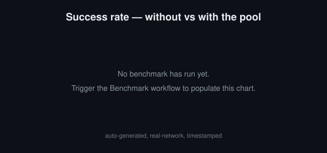
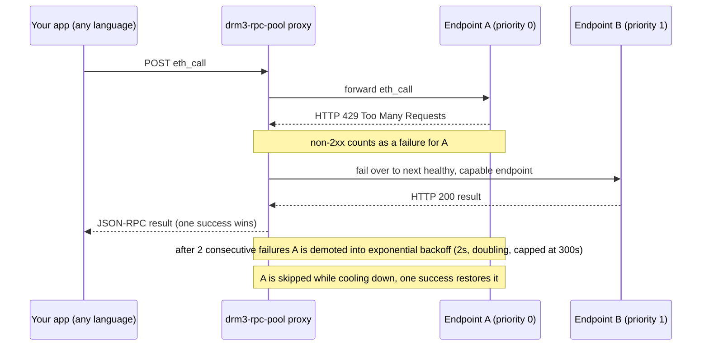

# drm3-rpc-pool

[](https://github.com/DRM3Labs-OSS/drm3-rpc-pool/actions/workflows/ci.yml)
[](./LICENSE)

> Config-driven JSON-RPC failover proxy for any EVM chain. Point any app at one endpoint and get automatic failover, health-aware routing, and rate-limit handling across your RPC providers. Rust library + WASM/TS package.

## The problem

A single hardcoded RPC URL is a single point of failure. Public providers rate-limit you (HTTP 429), lag under load, and go down without warning, and when yours does, your app goes down with it. Hardcoding one endpoint means betting your uptime on someone else's worst day.

drm3-rpc-pool fixes this without touching your app code: give it an ordered list of endpoints and point your app at the proxy. It does first-success-wins dispatch with per-endpoint health tracking, exponential backoff, capability routing, and automatic failover. Every capability is a generic `eth_*` method, so it works the same on Ethereum, Base, Arbitrum, Optimism, Polygon, BNB, or any other EVM chain. You do **not** need to write Rust to use it. Run the proxy, point any app in any language at its local address, and it inherits failover for free.

## Results - with vs without

The chart and table below are **auto-generated by CI** ([`benchmark.yml`](./.github/workflows/benchmark.yml)): a real-network run that fires the same concurrent load two ways, once at a *single* public endpoint, once *spread across the pool* with failover. Numbers are timestamped and vary with live public-RPC conditions; this is honest field data, not a controlled lab benchmark. Public endpoints are IP-rate-limited, so each mode runs on its own CI runner (its own IP). Adding your own keyed provider raises the ceiling well past what these no-key public endpoints can do.

<!-- BENCHMARK:START -->
_Auto-generated 2026-06-17 21:36:13 UTC — chain `base`, 300 requests at concurrency 60, FREE public endpoints (no key). Real-network field data, not a lab benchmark; numbers vary with live public-RPC conditions._



| Mode | Success rate | Throughput (req/s) | p50 latency | p95 latency |
|------|-------------:|-------------------:|------------:|------------:|
| Without pool (single endpoint) | 49.3% | 120.9 | 84 ms | 333 ms |
| With pool (failover) | 100.0% | 121.9 | 99 ms | 1464 ms |

_Run it yourself: `cargo run --release --example throughput` (see [Throughput benchmark](#throughput-benchmark))._
<!-- BENCHMARK:END -->

## How it works



- **Unbounded, priority-ordered pool.** Lower `priority` is tried first; ties break by config order.
- **First-success-wins dispatch.** Try candidates in order, return the moment one succeeds.
- **Failure detection.** Any non-2xx response (429 rate-limit, 5xx, etc.) or transport error counts as a failure for that endpoint.
- **Demotion + backoff.** After `demotion_threshold` (default 2) consecutive failures an endpoint is demoted into an exponentially growing cooldown (base 2s, doubling per failure, capped at 300s). One success resets it.
- **Capability routing.** Tag an endpoint with the methods it supports and the pool skips it for calls it cannot serve. An empty list means "supports everything".
- **Per-endpoint rate limiting.** Optional client-side `max_rps`; a locally-throttled endpoint is skipped (failed over), never awaited.
- **Per-endpoint auth.** URL-baked keys, custom headers, or bearer tokens, with secrets pulled from the environment.

## Primary usage: the proxy (no Rust required)

### 1. Scaffold a config

```sh
drm3-rpc-pool init base > rpc-pool.toml
```

`init` writes a starter config from a chain preset. Available presets: `base`, `ethereum`, `arbitrum`, `optimism`, `polygon`, `bnb` (aliases: `eth`/`mainnet`, `arb`, `op`, `matic`, `bsc`).

### 2. Edit endpoints and keys

Open `rpc-pool.toml`, add your own keyed providers at a lower `priority` so paid capacity is preferred and the public URLs act as failover. Put secrets in the environment via `${ENV_VAR}` templating (see [Auth](#auth--keyed-providers)). A full annotated example lives in [`examples/rpc-pool.toml`](./examples/rpc-pool.toml).

### 3. Run the proxy

```sh
export ALCHEMY_KEY=...          # whatever your config references
drm3-rpc-pool --config rpc-pool.toml
# drm3-rpc-pool listening on http://127.0.0.1:8545 (N endpoints)
```

`--config` defaults to `./rpc-pool.toml`, so plain `drm3-rpc-pool` works once the file exists.

### 4. Point any app at it

Set your application's RPC URL to the proxy's `listen` address. Examples:

```sh
# ethers.js / viem / web3.py / cast / hardhat - just change the URL:
export RPC_URL=http://127.0.0.1:8545
cast block-number --rpc-url http://127.0.0.1:8545
```

Everything that speaks JSON-RPC over HTTP works unchanged - single requests and batch arrays are both supported.

### Run with Docker (optional)

```sh
docker build -t drm3-rpc-pool .

docker run --rm -p 8545:8545 \
  -e ALCHEMY_KEY=... \
  -v "$PWD/rpc-pool.toml:/etc/drm3/rpc-pool.toml:ro" \
  drm3-rpc-pool
```

The image's default command is `--config /etc/drm3/rpc-pool.toml`. To reach the proxy from outside the container, set `listen = "0.0.0.0:8545"` in your config.

> **Warning: binding `0.0.0.0` exposes an unauthenticated relay.** The proxy has no auth of its own, so anything that can reach the listen address can spend your keyed/paid upstream providers. Only bind `0.0.0.0` behind a firewall, a private network, or your own auth layer. The default `127.0.0.1` is safe.

## Config schema

Configuration is TOML. Every string field supports `${ENV_VAR}` templating; a referenced-but-unset variable is a hard error, so a missing key never silently degrades to an unauthenticated request.

| Field | Type | Default | Notes |
|-------|------|---------|-------|
| `listen` | string | `127.0.0.1:8545` | `host:port` the proxy binds to. Use `0.0.0.0:8545` only behind a firewall/auth (see the Docker warning). Ignored by library callers. |
| `request_timeout_ms` | integer | transport default (15s) | Per-request timeout applied to each upstream attempt. |
| `max_retries` | integer | `0` | Max endpoints to try per call. `0` = try every healthy, capable candidate. |
| `[[endpoints]]` | array | - | One or more endpoint tables (below). At least one is required. |

Each `[[endpoints]]` table:

| Field | Type | Default | Notes |
|-------|------|---------|-------|
| `url` | string | required | HTTP(S) JSON-RPC URL. |
| `label` | string | - | Human-readable tag for logs and `/metrics`. Falls back to the URL. |
| `priority` | integer | `0` | Sort key. Lower is tried first; ties break by config order. |
| `capabilities` | array of strings | `[]` | Methods this endpoint may serve, e.g. `["eth_call", "eth_getLogs"]`. Empty = supports everything. |
| `max_rps` | integer | unthrottled | Client-side requests-per-second throttle. |
| `auth` | table | `{ type = "none" }` | See [Auth](#auth--keyed-providers). |

```toml
listen = "127.0.0.1:8545"
request_timeout_ms = 8000
max_retries = 0

[[endpoints]]
url = "https://base-mainnet.g.alchemy.com/v2/${ALCHEMY_KEY}"
label = "alchemy-base"
priority = 0
max_rps = 25
auth = { type = "url_key" }

[[endpoints]]
url = "https://mainnet.base.org"
label = "base-official"
priority = 10
```

## Auth / keyed providers

Secrets stay in the environment via `${ENV_VAR}`; the config file only references them. The `auth` table picks how the key is applied:

```toml
# UrlKey - the API key is already baked into the URL (Alchemy / Infura style).
# Declarative marker only; no extra headers are added.
[[endpoints]]
url = "https://eth-mainnet.g.alchemy.com/v2/${ALCHEMY_KEY}"
auth = { type = "url_key" }

# Header - a custom request header.
[[endpoints]]
url = "https://rpc.example-provider.com"
auth = { type = "header", name = "X-API-Key", value = "${PROVIDER_KEY}" }

# Bearer - adds `Authorization: Bearer <token>`.
[[endpoints]]
url = "https://rpc.another-provider.com"
auth = { type = "bearer", token = "${PROVIDER_TOKEN}" }
```

Omitting `auth` is equivalent to `{ type = "none" }` - the URL is used as-is.

## Chain presets

`init <chain>` ships sensible public endpoint lists for:

| Preset | Aliases | Chain |
|--------|---------|-------|
| `base` | - | Base mainnet (8453) |
| `ethereum` | `eth`, `mainnet` | Ethereum mainnet (1) |
| `arbitrum` | `arb` | Arbitrum One (42161) |
| `optimism` | `op` | OP Mainnet (10) |
| `polygon` | `matic` | Polygon PoS (137) |
| `bnb` | `bsc` | BNB Smart Chain (56) |

Presets are a starting point of public, no-key endpoints. Public endpoints come and go - treat them as defaults to override with your own keyed providers.

## HTTP endpoints

The proxy serves three routes:

- `POST /` - the JSON-RPC entrypoint. Accepts a single request object or a batch array. The client's `id` is preserved; upstream JSON-RPC error envelopes and pool-level errors (e.g. `-32010` all upstreams failed, `-32011` no healthy endpoints) are relayed back.
- `GET /health` - `200` with `{ status, endpoints_total, endpoints_healthy }` when the pool has endpoints; `503` if empty.
- `GET /metrics` - per-endpoint status snapshot (definition + live health) as JSON.

## Secondary usage: the Rust library

Add the crate and drive the pool directly. The default build bundles a `reqwest` transport.

```rust
use drm3_rpc_pool::{RpcEndpoint, RpcPool, RpcPoolConfig, RpcCapability};
use serde_json::json;

#[tokio::main]
async fn main() -> Result<(), Box<dyn std::error::Error>> {
    let config = RpcPoolConfig {
        endpoints: vec![
            RpcEndpoint {
                url: "https://base.llamarpc.com".into(),
                label: Some("llamarpc".into()),
                priority: 0,
                capabilities: vec![RpcCapability::EthCall, RpcCapability::EthBlockNumber],
                max_rps: None,
                auth: Default::default(),
            },
            RpcEndpoint {
                url: "https://mainnet.base.org".into(),
                label: Some("base-public".into()),
                priority: 1,
                capabilities: vec![RpcCapability::EthCall, RpcCapability::EthGetLogs],
                max_rps: Some(10),
                auth: Default::default(),
            },
        ],
        ..RpcPoolConfig::default()
    };

    let pool = RpcPool::with_default_transport(config);
    let block: serde_json::Value = pool.call("eth_blockNumber", json!([])).await?;
    println!("block = {}", block);
    Ok(())
}
```

You can also build a config from URLs (`RpcPoolConfig::from_urls([...])`), from a preset (`presets::config_for("base")`), or from a TOML file (`RpcPoolConfig::from_toml_file(path)`). Supply your own HTTP client by implementing the `Transport` trait, and your own observability via the `Metrics` trait.

### Cargo features

- `reqwest-transport` (default) - bundled `reqwest` HTTP transport. Disable to supply your own `Transport`.
- `daemon` (default) - the proxy binary and HTTP server (axum + clap). Disable for a pure library build.

## Throughput benchmark

The [`throughput` example](./examples/throughput.rs) reproduces the [Results](#results--with-vs-without) numbers. It fires N concurrent `eth_blockNumber` requests two ways and reports success-rate, throughput (req/s), and p50/p95 latency as JSON:

```sh
# Mode A - all load at ONE public endpoint (no pool, no failover):
cargo run --release --example throughput -- --mode single --chain base --requests 300 --concurrency 50

# Mode B - same load spread across the pool, with failover:
cargo run --release --example throughput -- --mode pool --chain base --requests 300 --concurrency 50
```

Each mode prints a single JSON line, e.g.:

```json
{"mode":"pool","chain":"base","requests":300,"concurrency":50,"ok":300,"err":0,"success_rate":1.0,"elapsed_s":4.21,"throughput_rps":71.3,"p50_ms":120,"p95_ms":410}
```

Flags: `--mode single|pool`, `--chain <preset>`, `--requests <N>`, `--concurrency <N>`, `--endpoint <url>` (override the single-mode target). It uses **free public endpoints** - no key required. The two modes are run on separate CI runners (separate IPs) because public RPCs are IP-rate-limited and would otherwise squash each other's limits; that's why [`benchmark.yml`](./.github/workflows/benchmark.yml) splits them into separate jobs. Supplying your own keyed provider in a config raises the ceiling well past these public defaults.

## License

MIT © DRM3 Labs Corp.

Contributions welcome - see [CONTRIBUTING.md](./CONTRIBUTING.md).
